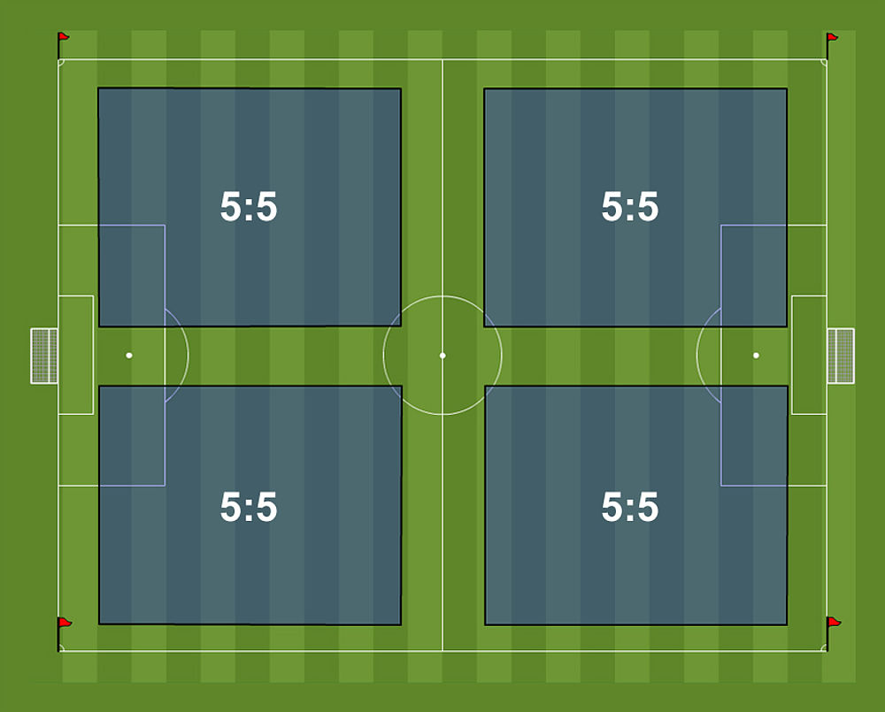
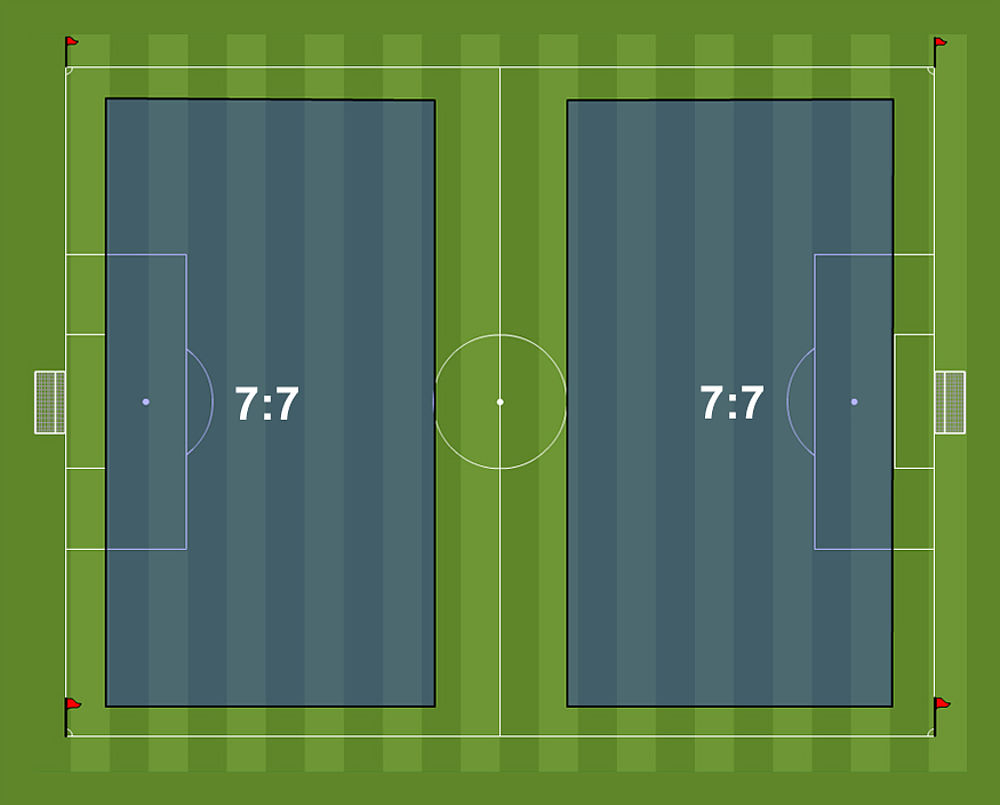

# Soccer fields

##  Goal and Field sizes

https://www.usyouthsoccer.org/referees/rules-of-the-game/ is source of this info

Age Group	| Maximum Goal Size (in feet) |	Field Width  Min. - Max. (in yards) | Field Length  Min. - Max. (in yards)
:----------:|:---------------------------:|:----------------------------------:|:----------------------------------:
6U & 8U	    | 4’ x 6’	                  | 15 - 25	                           |  25 - 35
10U	        | 6.5' x 18.5'	              | 35 - 45                            |  55 - 65
12U	        | 7' x 21'	                  | 45 - 55	                           |  70 - 80
14U+	    | 8’ x 24’	                  | 50 - 100	                       | 100 - 130

## Visualization of fields
It's important to note that there is 'overlap' between age groups and team on the field. The overlap is to deal with the physical space available to offer these age groups competitive games. 

You should never try to 'squeeze' more kids on the field than the space allows.

## Grassroots - FIFA
The following formats are suggested by FIFA:

### U8 age group	
   * 4 v 4 without goalkeeper           - Recommended and used in Hanover -
   * 4 v 4 with goalkeeper (3+1 v 3+1)  - Old format. Didn't get results -
   * 5 v 5                              - The extra space required means this not feasible -

### U10 age group
   * 4 v 4 without goalkeeper (4 v 4)	- If re-using U8 fields - 
   * 4 v 4 with goalkeeper (3+1 v 3+1)	- If re-using U8 fields -
   * 5 v 5	                            - Smaller size U10 fields -
   * 7 v 7                              - Full size U10 fields -

### U12 age group
   * 4 v 4 without goalkeeper (4 v 4)	- Reusing U8 fields -
   * 4 v 4 with goalkeeper (3+1 v 3+1)	- Reusing U8 fields -
   * 5 v 5								- Reusing small U10 fields -
   * 7 v 7								- Small size U12 fields -
   * 9 v 9								- Full size U10 fields -

### Small size games
6 to 8 years old - 4 v 4 is without goalkeeper

9 to 10 years old - 5 v 5 with goalkeeper

9 to 10 years old - 7 v 7 with goalkeeper

11 to 12 years old - 9 v 9 with goalkeeper

